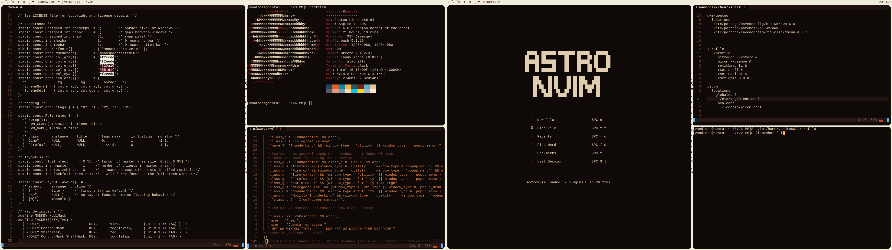
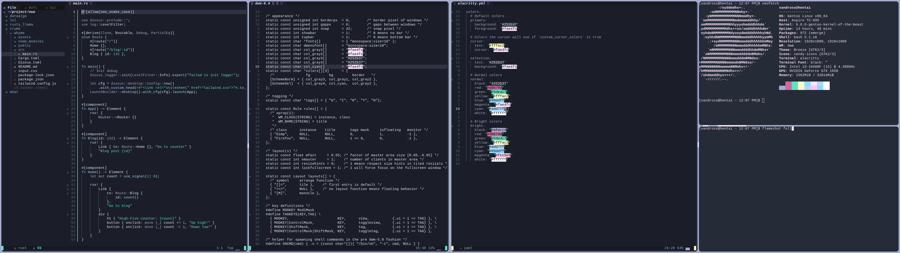
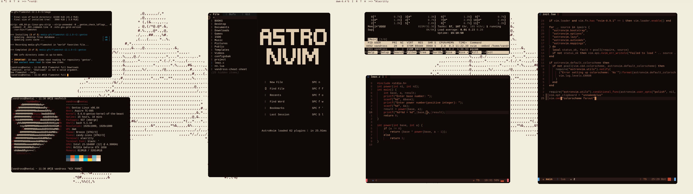
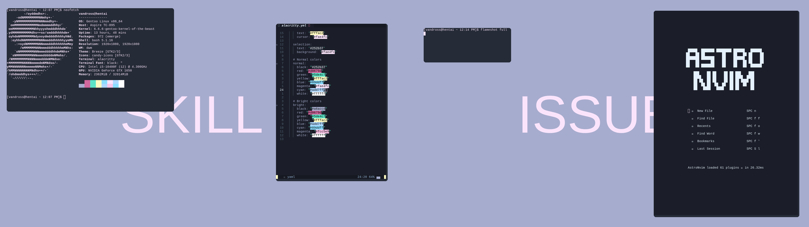

# Gentoo dwm Rice Dotfiles - Winter24 & Spring24 Setups

This repository showcases my Gentoo dwm rice for "Winter24" and "Spring24". I run a very minimalistic setup with some theme customizations in Neovim and Alacritty to complement the aesthetics.

## About the Setups

### Winter24
System made to compliment the  "fcpg /vim-farout" theme

### Spring24
System made to compliment "olivercederborg / poimandres.nvim" theme

## Dependencies

- **dwm**: For window management.
- **Neovim**: For an extensible Vim-based text editor.
- **Alacritty**: A GPU-accelerated terminal emulator.
- Other dependencies include specific fonts and utilities detailed in each theme's instructions.

## Acknowledgments

- Thanks to the suckless community for dwm and dmenu.
- Appreciation for the Gentoo community for their comprehensive documentation and support.

# Gentoo dwm Rice Dotfiles - Winter24 & Spring24 -asetukset

Tämä repositorio esittelee Gentoo dwm rice -konfiguraatioitani "Winter24" ja "Spring24" asetuksille minimalistisessa setupissa. 

## Asetuksista

### Winter24
Tehty mukailemaan "olivercederborg / poimandres.nvim" teemaa

### Spring24
Ei liity paljoakaan vuodenaikaan muuten kuin että käytin sitä vuoden 2024 kevään aikana.

## Riippuvuudet

- **dwm**: Ikkunoiden hallintaan.
- **Neovim**: Laajennettavaksi Vim-pohjaiseksi tekstieditoriksi.
- **Alacritty**: GPU-kiihdytetty terminaaliemulaattori.
- Muita riippuvuuksia sisältävät tietynlaiset fontit ja apuohjelmat, jotka on yksityiskohtaisesti selitetty kunkin teeman ohjeissa.

## Kiitokset

- Kiitokset suckless-yhteisölle dwm:stä ja dmenusta.
- Kiitokset Gentoo-yhteisölle heidän kattavasta dokumentaatiostaan ja tuestaan.

